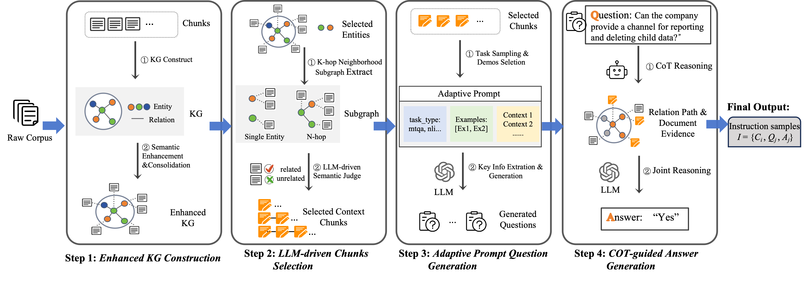

# Enhanced Knowledge Graph Construction Module

> Part of **GCIG: GraphRAG-based Cross-document Instruction Generation for Boosting LLM Reasoning**

## Overview

The **Enhanced Knowledge Graph (EKG) Construction Module** implements a comprehensive pipeline for automated knowledge graph construction from unstructured textual corpora. This module serves as the foundational component of GCIG, leveraging Large Language Models (LLMs) to extract entities and relations, perform semantic summarization, entity alignment, and contextual linking—ultimately generating a structured, queryable knowledge representation that enables cross-document reasoning.

<p align="center">
  
</p>

## System Architecture

The construction pipeline comprises four sequential stages, each implemented as an independent module with well-defined interfaces:

```
Text Corpus → Entity Extraction → Summarization & Embedding → Entity Alignment → Graph Connection
     ↓              ↓                      ↓                       ↓                   ↓
  Raw Text    entities.parquet      +description/embedding    +alias mapping    text_units.parquet
```

### Pipeline Stages

| Stage | Module | Description |
|-------|--------|-------------|
| 1 | `graph_mult_construct.py` | Multi-threaded entity and relation extraction |
| 2 | `graph_summary.py` | Semantic summarization and embedding generation |
| 3 | `graph_align.py` | Entity alignment and disambiguation |
| 4 | `graph_connect.py` | Text unit connection and linking |

## Module Specifications

### Stage 1: Graph Construction (`graph_mult_construct.py`)

**Purpose**: Extract structured entities and relations from unstructured text using LLM-based information extraction.

**Key Features**:
- Multi-threaded parallel processing for large-scale corpus handling
- Robust error handling with exponential backoff retry mechanisms
- Incremental graph building with real-time persistence
- Support for domain-specific entity types: `PERSON`, `ORGANIZATION`, `PRODUCT`, `LEGALTERM`, `CONDITION`

**Technical Implementation**:
| Component | Description |
|-----------|-------------|
| Text Preprocessing | Control character removal, whitespace normalization, length constraint handling |
| Safe Extraction | Retry logic with configurable backoff parameters |
| Graph Merging | Thread-safe concurrent entity and relation update operations |
| Output Format | Apache Parquet (`entities.parquet`, `relations.parquet`) |

**Configuration Parameters**:
```python
max_gleanings = 1      # LLM refinement iterations
chunk_size = 2048      # Text segmentation size (tokens)
num_threads = 15       # Parallel processing threads
```

---

### Stage 2: Semantic Summarization (`graph_summary.py`)

**Purpose**: Consolidate multiple descriptions per entity/relation into coherent summaries and generate semantic embeddings for downstream retrieval.

**Key Features**:
- Parallel processing of entities and relations via dual-threaded architecture
- LLM-based summarization for multi-description consolidation
- Batch embedding generation for semantic search capabilities

**Description Consolidation Strategy**:
| Condition | Action |
|-----------|--------|
| Single description | Direct usage |
| Multiple descriptions | LLM-generated summary |
| Empty descriptions | Null value assignment |

**Output Schema Enhancement**:
- `entities.parquet`: Updated with `description` (str) and `embedding` (vector) fields
- `relations.parquet`: Updated with `description` (str) and `embedding` (vector) fields

---

### Stage 3: Entity Alignment (`graph_align.py`)

**Purpose**: Resolve entity ambiguity and merge duplicate entities through multi-strategy alignment, implementing the disambiguation component critical for cross-document knowledge integration.

**Alignment Pipeline** (applied sequentially):

```
Candidate Entities → Type Filter → Similarity Filter → LLM Disambiguation → Alias Mapping
                        ↓              ↓                    ↓
                   Same type     cosine sim > 0.9     Final decision
```

| Strategy | Method | Threshold |
|----------|--------|-----------|
| Type-based | Entity type matching | Exact match |
| Similarity-based | Cosine similarity on embeddings | 0.9 |
| LLM-based | Language model reasoning | N/A |

**Output**: Alias mappings stored in `entities.parquet` (`alias` field)

---

### Stage 4: Graph Connection (`graph_connect.py`)

**Purpose**: Link original text units to extracted knowledge graph entities, enabling contextual retrieval for downstream instruction generation.

**Key Features**:
- Sentence-level entity recognition with configurable context expansion
- Overlap detection with threshold-based duplicate filtering
- Embedded text units for semantic search integration

**Configuration Parameters**:
| Parameter | Description | Default |
|-----------|-------------|---------|
| `expand` | Context window size (sentences) | 1 |
| `overlap_threshold` | Similarity cutoff for duplicate detection | 0.9 |

**Output Naming Convention**: `text_units-{expand}-{threshold}.parquet`

## Configuration

All configurations are centralized in `config.py`:

### Data Paths
```python
data_dir = "/path/to/input"           # Input corpus directory
db_dir = "/path/to/output"            # Output directory
graph_dir = os.path.join(db_dir, "graph")
text_unit_dir = os.path.join(db_dir, "text_units")
```

### LLM Configuration
```python
class LLMConfig:
    model = "gpt-4"                   # Model identifier
    api_key = "your-api-key"          # API authentication
    base_url = "https://api.openai.com/v1"
```

### Processing Parameters
```python
class SplitterConfig:
    chunk_size = 2048                 # Token-based chunking
    over_lap = 64                     # Overlap between chunks
    encoding_name = "cl100k_base"     # Tokenizer encoding

class ConnectorConfig:
    expand = 1                        # Context expansion window
    overlap_threshold = 0.9           # Duplicate detection threshold

class SimilarityAlignConfig:
    threshold = 0.9                   # Entity alignment threshold
```

## Execution

### Sequential Pipeline Execution

```bash
bash construct.sh
```

**Pipeline Sequence**:
```bash
python graph_mult_construct.py    # Stage 1: Entity extraction
python graph_summary.py           # Stage 2: Summarization & embedding
python graph_align.py             # Stage 3: Entity alignment
python graph_connect.py           # Stage 4: Text unit connection
```

## Output Schema

### Entities (`entities.parquet`)

| Field | Type | Description |
|-------|------|-------------|
| `id` | int | Unique entity identifier |
| `name` | str | Canonical entity name |
| `type` | str | Entity type (`PERSON`/`ORGANIZATION`/`PRODUCT`/`LEGALTERM`/`CONDITION`) |
| `description` | str | LLM-summarized entity description |
| `embedding` | array[float] | Semantic embedding vector |
| `alias` | int/None | Aligned entity ID (if duplicate) |

### Relations (`relations.parquet`)

| Field | Type | Description |
|-------|------|-------------|
| `id` | int | Unique relation identifier |
| `source` | int | Source entity ID |
| `target` | int | Target entity ID |
| `description` | str/list | Relation description(s) |
| `embedding` | array[float] | Semantic embedding vector |

### Text Units (`text_units-{expand}-{threshold}.parquet`)

| Field | Type | Description |
|-------|------|-------------|
| `content` | str | Text unit content |
| `entities` | list[int] | Linked entity IDs |
| `embedding` | array[float] | Text embedding vector |

## Dependencies

```
networkx>=2.6        # Graph data structure
pandas>=1.3          # DataFrame operations
pyarrow>=8.0         # Parquet I/O
graphrag             # Core extraction and alignment library
tqdm>=4.62           # Progress visualization
openai>=1.0          # LLM API client
```

## Performance Considerations

| Aspect | Implementation |
|--------|----------------|
| Parallelization | Multi-threaded processing with configurable thread pools |
| Persistence | Real-time incremental saving prevents data loss |
| Embedding | Batch processing reduces API calls |
| Resilience | Comprehensive exception handling with graceful degradation |

## Citation

If you use this module in your research, please cite:

```bibtex
@inproceedings{gcig2025,
  title={GCIG: GraphRAG-based Cross-document Instruction Generation for Boosting LLM Reasoning},
  author={},
  booktitle={},
  year={2025}
}
```

## License

This module is part of the GCIG project, licensed under the Apache License 2.0.
