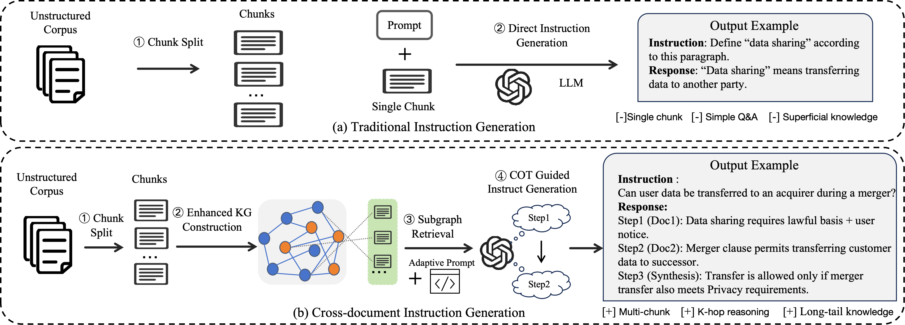
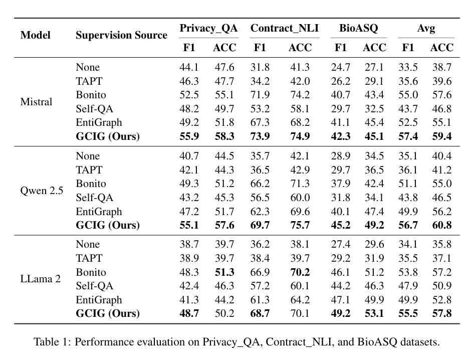

# GCIG: GraphRAG-based Cross-document Instruction Generation


Official implementation of the paper: **"GCIG: GraphRAG-based Cross-document Instruction Generation for Boosting LLM Reasoning"**

<p align="center">
  
</p>

## Overview

GCIG is a framework for automatically generating high-quality cross-document instruction data to enhance LLMs' complex reasoning capabilities. Unlike existing methods that rely on isolated documents, GCIG leverages GraphRAG to integrate knowledge across documents and generate instruction data with better logical coherence and broader knowledge coverage.

### Key Features

- **Enhanced Knowledge Graph Construction**: Builds entity-centric graphs linking document evidence with entities
- **LLM-driven Chunk Selection (LCS)**: Forms multi-hop evidence chains with factual consistency
- **Adaptive Prompt-based Question Generation (APQG)**: Produces diverse multi-hop questions
- **Chain-of-Thought-guided Answer Generation (CoTAG)**: Generates interpretable answers with logical depth

<p align="center">
  
</p>

## Project Structure

```

```

## Installation

### Requirements

- Python >= 3.8
- PyTorch >= 2.0
- CUDA >= 11.7 (for GPU acceleration)

### Setup

```bash
# Clone the repository
git clone https://github.com/WhitEiller/GCIG.git
cd GCIG

# Create virtual environment
conda create -n gcig python=3.10
conda activate gcig

# Install dependencies
pip install -r requirements.txt

# Install GCIG
cd GCIG
pip install -e .
cd ..
```

## Quick Start

### 1. Build Enhanced Knowledge Graph

```python
from EKG_Instruct.GC.graph_mutl_construct import build_enhanced_kg

# Build knowledge graph from corpus
kg = build_enhanced_kg(
    corpus_path="path/to/your/corpus",
    output_path="path/to/output/kg"
)
```

### 2. Generate Instructions using GraphGen

```bash
cd GraphGen

# Configure your API key
cp .env.example .env
# Edit .env to add your API key

# Run instruction generation
python -m graphgen.generate \
    --input_path path/to/corpus \
    --output_path path/to/output \
    --model gpt-4
```

### 3. Evaluate Generated Data

```bash
cd nayak-aclfindings24-code

# Run evaluation
bash run_eval_all_models.sh
```

## Experimental Results

<p align="center">
  
</p>

## Components

### GraphGen

A framework for synthetic data generation guided by knowledge graphs. Supports:
- Multiple LLM inference backends (OpenAI, Ollama, vLLM, SGLang)
- Various data sources (files, databases, search engines)
- Multiple output formats (Atomic, Aggregated, CoT, Multi-hop, VQA)

See [GraphGen README](GraphGen/README.md) for detailed documentation.

### EKG-Instruct

Enhanced Knowledge Graph based instruction generation:
- `GC/`: Graph construction with entity extraction and alignment
- `generate/`: Question and answer generation with adaptive prompts

### Baselines

We compare against several baseline methods:
- Self-Instruct
- Bonito
- RAG-Instruct
- EntiGraph

## Configuration

### Environment Variables

Create a `.env` file in the root directory:

```bash
# API Configuration
OPENAI_API_KEY=your_api_key
OPENAI_BASE_URL=https://api.openai.com/v1

# Model Configuration
DEFAULT_MODEL=gpt-4
EMBEDDING_MODEL=text-embedding-ada-002
```

## Citation

If you find this work useful, please cite our paper:

```bibtex
@inproceedings{gcig2025,
  title={GCIG: GraphRAG-based Cross-document Instruction Generation for Boosting LLM Reasoning},
  author={},
  booktitle={},
  year={2025}
}
```

## Acknowledgements

This project builds upon several excellent open-source projects:
- [GraphGen](https://github.com/open-sciencelab/GraphGen)
- [GraphRAG](https://github.com/microsoft/graphrag)
- [Bonito](https://github.com/BatsResearch/bonito)
- [LLaMA-Factory](https://github.com/hiyouga/LLaMA-Factory)

## License

This project is licensed under the Apache License 2.0 - see the [LICENSE](LICENSE) file for details.

## Contact

For questions and feedback, please open an issue on GitHub.
